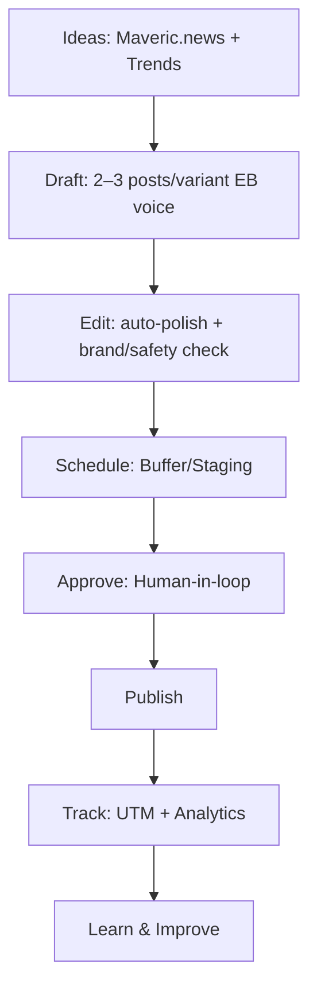
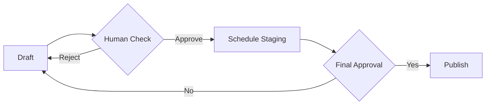

# 🚀 Content Engine Plan (Dag 1–3)

## 📌 Day 1 – Foundations

### Scope Brief (v1.0)
**Doelstellingen:**
- Dagelijks posten op X, LinkedIn, TikTok
- Groei in bereik, CTR en volgers → conversie naar Maveric.news

**Constraints:**
- Brand voice = Eric Burnik (EB)
- TOS/social limits respecteren
- Eén pipeline, geen losse tools

**KPIs:**
- Posts/day: 3–5 per kanaal
- CTR target: >4%
- Follow growth: +10% maand op maand

---

### Agent Map

---

### Tool Shortlist
| Stap       | Optie 1    | Optie 2    | Optie 3 | Pros/Cons                 | API Notes         |
|------------|------------|------------|---------|---------------------------|-------------------|
| Ideation   | GPT-5      | Jasper     | Copy.ai | GPT beste voor trends     | GPT + webhooks    |
| Edit       | Grammarly  | Writer     | Claude  | Writer = brand guardrails | API access        |
| Schedule   | Buffer     | Hootsuite  | Later   | Buffer lichtgewicht       | Buffer API stable |
| Analytics  | Notion roll-up | Airtable | GA4   | Airtable = visueel        | API sync          |

---

### Risk Register
- Brand drift → mitigatie: EB voice checklist
- Platform TOS breach → mitigatie: compliance bot
- API throttling → mitigatie: rate limits monitoren
- Data loss → mitigatie: automatische backups
- Onvoldoende engagement → mitigatie: A/B testing
- Reputatieschade → mitigatie: pre-approval gates
- Duplicate content → mitigatie: cross-check systeem
- Slechte CTR → mitigatie: hooks testen
- Shadowban risico → mitigatie: spreiding posts
- Workflow crash → mitigatie: fail-safe fallback

---

### OKR/KPI Board
- Weekly target: 21–35 posts live
- CTR logs + volgers groei tracken
- Dashboard schema: Airtable (content log) + Notion roll-up

---

## 📌 Day 2 – Pilot & Governance

### Pilot Workflow Spec
**Prompt structuur:**
- Input: onderwerp, trend, kanaal, EB stijl
- Output: 2–3 varianten + metadata (tags, CTA, tone, lengte)

**Review stappen:**
1. Draft → auto-polish
2. Brand/safety check
3. Human review (approve/reject/tweak)
4. Schedule → staging

**Hand-offs:**
- Agent → Reviewer: Notion checklist
- Reviewer → Scheduler: Airtable status update

---

### Content Policy
- ✅ EB voice consistent
- ✅ Korte & krachtige hooks
- ✅ Relevante hashtags
- ❌ Geen banned phrases
- ❌ Geen persoonlijke data
- ❌ Geen clickbait zonder waarde

---

### Approval Gates

---

### Publishing Calendar (voorbeeld)
| Datum | Tijd  | Kanaal   | Content type | Status   | Review notes   |
|-------|-------|----------|--------------|----------|----------------|
| 01-10 | 09:00 | LinkedIn | Post + visual| Draft    | –              |
| 01-10 | 12:00 | X        | Short hook   | Approved | –              |
| 01-10 | 18:00 | TikTok   | Short video  | Draft    | Needs review   |

---

### Decision Document (v1 Toolchain)
**Keuze:**
- Ideation: GPT-5
- Edit: Writer
- Schedule: Buffer
- Analytics: Airtable + Notion roll-up

**Trade-offs:**
- Buffer simpel, beperkt analytics
- Writer = betere brand guardrails
- Airtable + Notion combineren voor overzicht

---

## 📌 Day 3 – Testing & Rollout

### Run-of-show (24h dry run)
- 09:00 – Drafts genereren
- 11:00 – Brand/safety check
- 13:00 – Human review
- 15:00 – Schedule posts in Buffer
- 18:00 – Eerste publicaties live
- 21:00 – Analytics check + feedback loop
- 23:00 – Rapportage in Notion

---

### Bug Bash Script (12 tests)
1. Draft fout → reject flow werkt?
2. Approve flow zonder staging?
3. Scheduler faalt → fallback?
4. Dubbele post detectie?
5. API limit bereikt → queue werkt?
6. CTR niet gelogd → back-up logging?
7. Analytics sync fout → manual export?
8. Buffer down → handmatige post?
9. Human review skip → alarm?
10. TOS violation detectie?
11. Voice drift detectie?
12. Workflow restart check?

---

### Onboarding Doc (2 pagina SOP)
- Hoe drafts gegenereerd worden
- Hoe je reviewt (approve/reject)
- Hoe scheduling werkt
- Welke metrics je moet loggen
- Escalatieprocedure bij fout

---

### Scorecard (Dagelijkse Metrics)
| Datum | Kanaal | Posts | CTR (%) | Engagement | Volgers+ | Opmerkingen |
|-------|--------|-------|---------|------------|----------|-------------|

---

### Executive Summary (voor EB)
- 10 slides:  
  1. Doelen  
  2. Scope  
  3. Workflow map  
  4. Toolchain keuzes  
  5. Risk register  
  6. Governance model  
  7. Calendar demo  
  8. Dry-run learnings  
  9. Metrics dashboard  
  10. Next steps  

**Bold takeaway:** Eén pipeline. Gesloten loop. Elke post leert de volgende beter maken.
